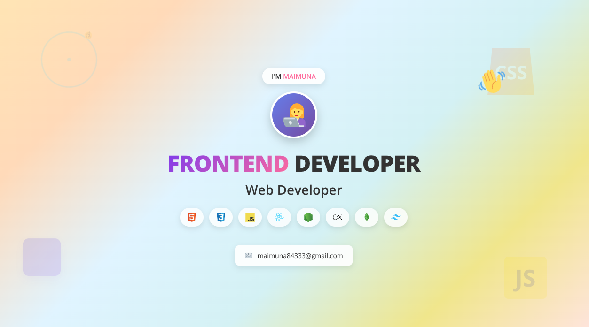

<!-- ====================== Banner ====================== -->

  

<h1 align="center">Hi, I'm Maimuna 👋</h1>

  <strong>I'm a passionate Frontend Web Developer | MERN Stack Learner | JavaScript, React.js, Node.js | 
Building Modern Web Apps & Scalable Backends 🌍 | I love learning new technologies, solving complex problems, and sharing knowledge with the community. Outside of coding, I enjoy contributing to open-source projects and writing about web development. 💡</strong>

---

<!-- ====================== Typing Animation ====================== -->

  

---

# 👩‍💻 About Me

- 🤖 Passionate **Frontend Developer** specializing in **JavaScript, React.js, React Router, Next.js, and Tailwind CSS**
- 🚀 Focused on **clean UI, responsive layouts, animations, and great user experiences**  
- 💻 Enjoy **building interactive web applications and reusable UI components**  
- 👩‍💻 Continuously learning **TypeScript, Node.js, Express.js, MongoDB, and advanced frontend patterns**   
- 🎯 2025 Goal — Become a **professional Frontend Engineer / MERN Stack Developer**  
- 📫 Reach me at: **maimuna84333@gmail.com**

---

### 🧑‍💻 About Me Beyond Coding

- 🛠 &nbsp; Exploring and building projects with <strong>JavaScript, TypeScript, React, Node.js, Express, MongoDB & Next.js</strong> — crafting dynamic, scalable, and modern web applications
- 📚 &nbsp; Learning advanced **React** patterns and diving deeper into **Next.js**
- 💡 &nbsp; Optimizing backend performance and building efficient APIs with **Node.js** and **Express.js**
- 👩‍💻 &nbsp; Enhancing database design skills and working on **MongoDB** optimization
- 📫 &nbsp; Reach me out: <strong>maimuna84333@gmail.com.</strong>

---
## 💼 Tech Stack

| Skills Overview | 🛠️ Technologies |
|----------|---------------|
| **Languages** |   |
| **Frontend** |      |
| **Backend** |    |
| **Databases** |   |
| **Tools & Services** |     |

---

## 🌐 Socials:
  

---

# ⚡ GitHub Stats

  
  

  

---

# 📊 Activity Graph

  

---

# 🌐 Connect With Me

  
  
  
  
  

---

### ✍ Random Dev Quote

